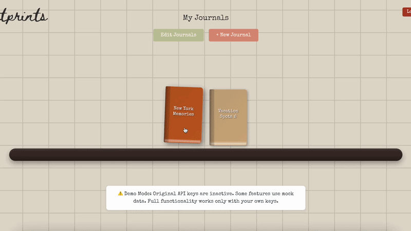

## Project Overview
**Footprints** is a digital diary that lets you aesthetically document the places you’ve been: restaurants, bars, cafés, hotels, spas, and more.

Using the Yelp AI API, it extracts rich, niche details about each business: menu highlights, ambiance, and unique characteristics, etc and transforms them into custom-designed journal components allowing users to create shareable journal entries with drag-and-drop editing.

**How It Works:**
- **Choose a Location**: Search and select from thousands of locations using Yelp's database
- **Content Generation**: Automatically generate personalized vibes, menu descriptions, and AI illustrations you can use in your journal
- **Design Your Page**: Use the drag-and-drop canvas editor to arrange text, images, and journal components
- **Share & Discover**: Publish your journal pages to the community gallery or share them directly to others (future implementation)



[](https://www.youtube.com/watch?v=43xy2siFags)

## Technical Architecture

**Core Technologies**<br>

<table>
  <tr>
    <td align="center"> <br> <sub>React 19</sub> </td>
    <td align="center"> <br> <sub>TypeScript</sub> </td>
    <td align="center"> <br> <sub>Firebase</sub> </td>
    <td align="center"> <br> <sub>Vite</sub> </td>
    <td align="center"> <br> <sub>Vercel</sub> </td>
  </tr>
  <tr>
    <td align="center"> <br> <sub>OpenAI</sub> </td>
    <td align="center"> <br> <sub>Yelp API</sub> </td>
    <td align="center"> <br> <sub>HTML5 Canvas</sub> </td>
    <td align="center"> <br> <sub>CSS3</sub> </td>
    <td align="center"> <br> <sub>npm</sub> </td>
  </tr>
</table>

**Technical Features**
- **Drag-and-Drop Canvas Editor**: Intuitive visual editor for arranging text, images, and journal components
- **Custom Journalling Component Generation**: Uses Yelp AI API to extract niche info on the place - eg 3 words that describe the vibe. Using this, it dynamically creates journal components
- **Community Gallery**: Public showcase of user-created journal pages with live previews (to be implemented)
- **Restaurant Search Integration**: Direct connection to Yelp's restaurant database with autocomplete
- **Responsive Design**: Optimized experience across desktop and mobile devices
- **Firebase Authentication**: Secure user accounts with email/password authentication
- **Cloud Data Storage**: Persistent journal storage using Firestore NoSQL database

## Usage & Testing
**Using the Deployed Application**

🔗 The app is live & ready to use - <a href="https://try-footprints.vercel.app/">Try It Out</a>

<div style="border: 1px solid rgba(176, 174, 172, 1); padding: 10px; border-radius: 5px; margin-top: 10px; display: inline-block; margin-left: 20px;">
  <em>Testing Notes</em>
  <ul>
    <li>As of 03/28/2026, API usage has been disabled. Project is now in demo mode only. Full functionality works only with your own keys in local development</li>
    <li>Test account information already pre-filled once you load website</li>
    <li>OpenAI DALL-E 3 image generation may take a while</li>
    <!--<li>Firebase storage has document size limits for gallery sharing</li>-->
  </ul>
</div>

### Local Development Setup

Here's all the steps you need to run Footprints locally:

**Prerequisites**
- Node.js (version 18 or higher)
- npm or yarn package manager
- Git

**Setup Instructions**
1. **Clone the Repository**
   ```bash
   git clone https://github.com/jessicauv/footprints.git
   cd footprints
   ```

2. **Install Dependencies**
   ```bash
   npm install
   ```

3. **Environment Setup**
   - Copy `.env.example` to `.env`
   - Get API keys from the following services:
     - **OpenAI API Key**: [https://platform.openai.com/api-keys](https://platform.openai.com/api-keys)
     - **Yelp API Key**: [https://www.yelp.com/developers](https://www.yelp.com/developers)

4. **Configure Environment Variables**
   Add your API keys to the `.env` file:
   ```env
   VITE_OPENAI_API_KEY=your_openai_key_here
   VITE_YELP_API_KEY=your_yelp_key_here
   ```

5. **Demo Mode (Optional)**
   - Demo mode is enabled by default in `src/config.ts`
   - To toggle demo mode, edit the `DEMO_MODE` variable:
     ```typescript
     export const DEMO_MODE = true;  // Enable demo mode (uses mock data)
     export const DEMO_MODE = false; // Disable demo mode (requires API keys)
     ```
   - **Demo mode features:**
     - Uses mock restaurant data instead of Yelp API
     - Uses pre-generated demo images instead of OpenAI API
     - No API keys required to run the application
     - Perfect for testing and development without API costs

**Running Instructions**

Start the development server:
```bash
npm run dev
```

The application will be available at `http://localhost:5173`

## Disclosures

**AI Usage Statement**<br>
This project leverages AI technologies in the following ways:

- **AI in the Application**:
  - Yelp AI API
  - OpenAI DALL-E 3

- **AI in Development**:
  - Used AI-assisted tool ClineAI for general development and debugging needs
  - All AI-generated code was reviewed, tested, and modified by human developers
